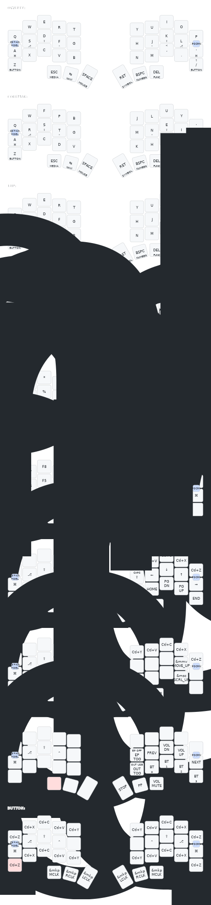

# Temper ZMK Config

This is my personal ZMK config for the [temper](https://github.com/raeedcho/temper).

Some notes about this config:
- Based on the Miryoku layout
- Default layer is Colemak DHm, but there's also a QWERTY layer that can be toggled on

